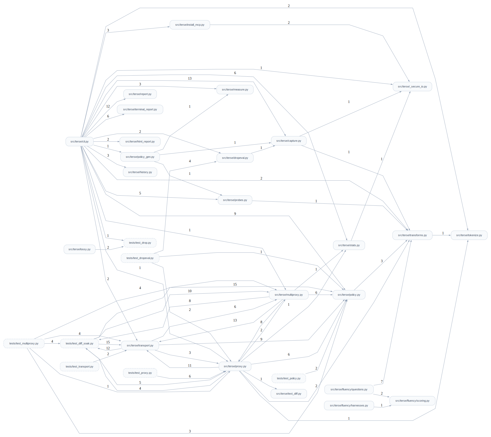

# Technical Reference: terse

## Architecture

terse is a pure-Python library with a thin CLI. The core is a deterministic,
fully-lossless transform pipeline; everything else (measurement, probes, policy)
is built around it.

```
raw tool output (JSON text)
        │
        ▼
 json.loads ──► compress_structure  (Tier 0: tabularize, recursive nested-key fold)
        │              │
        │              ▼
        │        dict_encode        (Tier 0.5: fold repeated string values -> legend)
        │              │
        │              ▼
        │          minify           (Tier 0: strip whitespace, serialize)
        ▼              │
   (policy decides ◄───┘
    which tiers run per tool)
        │
        ▼
   compressed JSON text  ──► decompress ──► byte-identical original
```

**Design decisions:**

- **Lossless gate is non-negotiable.** `transforms.roundtrip_ok(obj)` runs
  `decompress(compress(obj)) == obj`. Token availability changes *which* values get
  aliased (a performance choice) but never correctness. The test suite is a
  parametrized battery of this gate.
- **Representation transform by default, not offload.** The lossless tiers produce valid
  input the model reads directly (a table, an inline legend) with no `retrieve` step — the
  core difference from lossy-offload approaches. The one deliberate exception is the opt-in
  `drop-to-retrieve` lossy mode (#10): where you explicitly mark a field, terse evicts it to
  a handle and serves it back through a synthetic `terse.retrieve` tool. Off by default —
  lossless-first is the rule, retrieve is the marked exception.
- **Row-major tables.** Tabularization keeps rows as rows (positional cells mapped to
  a `cols` header), including nested `subcols`, so the table stays as legible as
  CSV/markdown — the model already does position→header mapping for the outer table.
- **Aliases are collision-proof.** Dictionary aliases come from a `~`-sigil namespace
  that is checked disjoint from every literal string (keys and values) in the
  payload, so decode is an exact legend lookup with no ambiguity.
- **Selective, fail-closed policy.** Value is per-tool, so a policy gates which tiers
  run. An unmatched tool gets the lossless default and never a lossy op.
- **Determinism.** No clock/random in the transform path; same input → same output.
- **Prior art on the primitive vs. the bundle.** Lossless tabularization of uniform
  JSON arrays is independently published elsewhere (e.g. [TOON](https://toonformat.dev/),
  MIT-licensed, ~40% reduction, its own benchmark). terse doesn't claim novelty on
  that transform in isolation. The differentiated surface is the combination: an
  MCP-transport-agnostic proxy (no client/server changes required), cross-call
  diffing, a `drop-to-retrieve` lossy escape hatch, and a behavioral fluency gate
  (`terse fluency`) that every diff/lossy tier had to pass before it shipped on by
  default — none of the comparable formats or proxies bundle all of that.

## File Descriptions

- **`transforms.py`** — the lossless core.
  - `minify` / `compress_structure` (+ `_fold_records`) / `dict_encode` and their
    exact inverses (`decompress_structure` + `_unfold_row`, `dict_decode`).
  - `compress_with(obj, tabularize, dictionary)` applies a selectable subset of
    tiers; `compress`/`decompress`/`roundtrip_ok` are the full pipeline + gate.
  - Markers: `TABLE_MARKER`, `DICT_MARKER`, `ALIAS_SIGIL` (`~`).
  - Depends on `tokenize.count_cl100k` for the tokenizer-aware aliasing threshold.
- **`policy.py`** — `Rule`/`Policy` dataclasses, `load_policy` (JSON parse + validate),
  `default_policy`, `Policy.select` (first tool-glob match wins), and `apply()` which
  returns an `Applied` record (text, tiers run, skipped, warnings). The only module
  that knows about lossy field modes (which it parses and warns about, never executes).
- **`proxy.py`** — MCP stdio middleware. `Interceptor` is the pure message logic
  (records request `id → tool name`, compresses the matching `tools/call` result via
  `policy.apply`); it is transparent (non-result messages forwarded unchanged),
  fail-open (any error forwards the original), and frame-safe. `run_proxy` launches
  the downstream server as a subprocess and wires `Interceptor` to stdio with two
  pump threads.
- **`stats.py`** — the live savings ledger + `terse stats`. `build_record` /
  `classify_decision` produce one payload-FREE line per result (ts, server, tool,
  decision, char + cl100k token sizes — never content, which is what makes always-on
  safe where capture/audit must stay opt-in); the decision label is derived by
  sniffing the emitted text's envelope head (diff/textdiff marker, `== raw`,
  policy-tiers-empty), not by threading state out of the compression paths.
  `append_stats` rotates at 10 MB (one prior generation kept; single O_APPEND writes
  under PIPE_BUF stay atomic across concurrent proxies, and a torn tail from a
  crashed writer is self-healed with a newline before the next append).
  `load_stats`/`aggregate`/`build_stats_report` back the `stats` subcommand; token
  totals sum only fully-tokenized records (`untokenized` counts the rest — reported,
  never blended). The record's `server` is `proxy --server-name` when given (the config's
  own name — truthful, and what `install-mcp` bakes in), else `server_label`'s guess from
  the command basename, which misreads a launcher-wrapped server (kb behind secret-broker
  labels itself `sb-run`) — #83. Default path `$XDG_STATE_HOME/terse/stats.jsonl`; the
  proxy wires it via `build_stats_writer` (same never-load-bearing contract as
  capture/audit: the writer owns I/O only and lets failures out, and `Interceptor`
  swallows them — announcing the first of each kind unconditionally, further ones only
  under `--debug`, so a dead sink can't go silent *or* flood stderr; #131. The
  bookkeeping lives on the `Interceptor`, which multiproxy builds per peer, so there
  the guard is once per (peer, kind) — attribution over a single line). ON by
  default in `cli.py` (`--no-stats` / `--stats-log FILE`);
  the `run_proxy`/`run_multi_proxy` API default stays None (disabled) so library
  callers opt in explicitly.
- **`capture.py`** — `classify_shape` (pretty/compact JSON, array-of-records,
  long-text), `capture_payload` (writes a sha-idempotent envelope to `corpus/`),
  `load_corpus`, `coverage`, `extract_records`.
- **`measure.py`** — `measure_payload` (per-tier cl100k decomposition: `minify +
  tabularize + dictionary == tier_total`, re-runs the gate), `measure_corpus`, and
  `cross_tokenizer_savings` (cl100k vs o200k invariance).
- **`probes.py`** — `value_redundancy` and `cross_call_overlap`: upper-bound
  estimators for whether higher-ceiling levers (dictionary, cross-call diffing) are
  worth building. They measure, they do not compress.
- **`tokenize.py`** — `count(text, encoding)` over named tiktoken vocabs (cl100k,
  o200k) and `encode_cl100k` (token ids for probes).
- **`report.py`** — markdown renderers: `build_report` (savings by shape + per-tool +
  tier attribution + coverage + gate banner), `build_probe_report`,
  `build_tokenizer_report`.
- **`html_report.py`** — `build_html_report`'s charted HTML counterpart to
  `build_report`: inline-SVG diverging bars (savings), stacked bars (tier
  attribution), and a forest plot (`forest_plot`, per-model accuracy + 95% CI).
  `build_html_diff_report` wraps the forest plot into the comprehension-gap page
  behind `fluency --diff --html` (and `--diff-soak` / `--text-diff-eval`, whose
  paired results share the same shape). Pure stdlib string templates — no JS, no
  CDN, no new dependency — reuses `report.py`'s `_form_stats` / `_worst_case_gap`
  so the verdict never diverges from the markdown. Wired via `--html` on
  `measure`/`verify`/`fluency` (writes next to `--out`, same basename, `.html`
  suffix).
- **`terminal_report.py`** — zero-new-artifact bar-chart counterpart to `report.py`'s
  markdown. `build_terminal_report` covers `build_report`'s savings-by-shape /
  savings-by-tool / tier-attribution sections (gate/coverage stay markdown-only —
  already glance-readable as text). `build_terminal_diff_report` /
  `build_terminal_fluency_report` render a two-line-per-model forest plot (point + 95%
  CI whisker track, pass/fail badge) for `build_diff_report`'s / `build_fluency_report`'s
  verdict sections, fed by `report.py`'s `diff_gap_rows`/`fluency_gap_rows` so the gap a
  chart shows can never diverge from the markdown's gate. Unicode glyphs always print;
  ANSI color only when stdout is a tty and `NO_COLOR` is unset (piped/CI output keeps
  the shape of the win, just uncolored). Wired via `--bars` on `measure`/`verify`/
  `fluency`, printed straight to the terminal (nothing written to disk).
- **`cli.py`** — argparse dispatch for the subcommands.

## API Integrations

- **tiktoken (local)** — token counting under `cl100k_base` and `o200k_base`. No
  network at runtime after the one-time vocab download. Used for measurement and for
  the dictionary coder's cost-aware aliasing threshold. There is **no public local
  tokenizer for Claude 3+**, so cl100k is an estimate; cross-tokenizer invariance
  (cl100k vs o200k) is the keyless robustness check rather than a true Claude count.
- No other external services. terse does not call any tool APIs itself; it compresses
  output that is piped or passed to it.

## Configuration

### Policy file (JSON)

```jsonc
{
  "version": 1,                       // only 1 is supported; anything else is rejected
  "defaults": { "tiers": ["minify", "tabularize", "dictionary"] },
  "policies": [
    {
      "match": { "tool": "gh.*" },    // fnmatch glob on the tool name
      "tiers": ["minify", "tabularize", "dictionary"],   // [] = passthrough (skip)
      "capture": false,               // optional; never PERSIST this tool's payloads
      "structured": "compress",       // optional; "auto" (default) | "compress" | "leave"
      "fields": {                     // optional, per-field
        "result[].id":   { "critical": true },           // denylist: never made lossy
        "result[].body": { "lossy": "drop-to-retrieve" },// evicted to a handle; served by terse.retrieve
        // `$`-sigil paths select SPANS of a non-JSON payload instead of fields of an
        // object — the only lossy reach into long-text results. v1 selector: code_blocks.
        "$text.code_blocks": { "lossy": "drop-to-retrieve", "min": 400 }
      }
    }
  ]
}
```

- **Matching:** rules are evaluated in order; the first whose `match.tool` glob
  matches wins. No match → `defaults.tiers`. A rule is matched against, in order: the
  server-qualified name `{server}.{tool}` (when the server is known — see below), the
  tool name as given, then the bare part after multiproxy's `__` peer prefix. The first
  rule matching any candidate wins, so a server-scoped rule outranks a bare-name one.
- **Server-scoped globs need the server name (#83).** A rule like `runecho.*` is
  matching a *server*, but MCP tool names don't inherently carry one: kb names its own
  tools `kb.read.search` (so `kb.*` matches unaided), while runecho calls its tool plain
  `structure` (so `runecho.*` matched nothing and silently fell through to `defaults` —
  the rule looked authored and did nothing). Tell the proxy who the downstream is and
  the qualified candidate makes such a rule work for every server: `proxy --server-name
  runecho`, which `install-mcp` bakes in automatically from the config's own server name,
  and which multiproxy supplies per-peer from each peer's `name`. Without it, matching is
  unchanged (bare names only). A tool that already self-prefixes is never double-qualified
  (`kb.read.search` under server `kb` stays `kb.read.search`, not `kb.kb.read.search`).
- **Tiers:** any subset of `minify` / `tabularize` / `dictionary`. `minify` is implied
  by serialization (a warning is emitted if omitted). `[]` = passthrough.
- **`structured` (default `"auto"`, #128):** `"compress"` also runs this tool's
  `structuredContent` through the codec, replacing the typed field with a terse envelope.
  MCP 2025-06-18 lets a tool return that field beside a text block mirroring it, and
  terse historically compressed only the block — but measured against `claude` 2.1.218
  the client forwards the **typed field** to the model and discards the block entirely
  (`scripts/probe/structured_content/`; BENCHMARKS §6's scope note). On such a tool terse
  therefore delivered ~0%; with `"compress"` the same fixture measures **61.2%** of the
  model's actual context, captured end to end rather than inferred from the ledger.
  The risk of compressing it unconditionally is asymmetric: any client that validates the
  typed field against the tool's `outputSchema` (which the spec says clients SHOULD do)
  would see terse **break tools that worked**, while leaving it alone merely makes terse
  a no-op. `"auto"` — the default — resolves that **per connected client** rather than by
  guessing: the MCP `initialize` request carries `params.clientInfo`, a name the client
  *declares*, and the proxy sees it. terse compresses the typed field for clients measured
  not to validate (`policy.STRUCTURED_SAFE_CLIENTS`) and leaves it alone for every other
  client, for one that omits `clientInfo`, and for a library caller that never handshakes
  — **fail-closed in all three cases**. Explicit `"compress"`/`"leave"` always override it.
  The list is keyed on name, not name+version: a version ceiling would block every future
  release on one measurement, and a listed client that started validating would fail
  *loudly* (tool calls error visibly), with `"leave"` as a one-line override. The client
  version is logged under `--debug` so such a regression is diagnosable from a log.
  Codec only, no diff: diffing the typed field needs its own per-tool base and keyframe
  accounting, and is deliberately left unbuilt rather than half-built.
- **`capture` (default `true`, #85):** `false` means *never persist this tool's
  payloads* — the proxy skips both disk sinks that write raw content: the
  `--capture-dir` corpus tee and the `--debug-log` replay trace (whose records embed the
  raw payload too, so gating only the tee would be half a guard). The payload-free stats
  ledger still counts the tool — sizes and decision, never content — so a gated tool is
  measured, just never quoted. Nothing about what the client receives changes.
  This is **not** implied by `"tiers": []`: passthrough only stops compression and diff
  state; the capture tee sits above the tier logic and would still write to disk.
  Its purpose is to make "this tool's output must never hit disk" a declarative property
  of the policy — surviving re-wraps, reviewable in one place, and expressible under
  `--config` multiproxy (one process, one `capture_dir`, so omitting the flag can't
  exclude a single peer) — rather than an operator remembering never to pass
  `--capture-dir` to one particular wrapper. The motivating case is a
  credential-returning server: secret-broker's `reveal_credential` returns a plaintext
  value by design. Parsing is deliberately strict (`_coerce_capture`): a non-bool raises
  at load rather than coercing, because every wrong-typed value in Python is truthy
  (`bool("false") is True`) and a lax coercion would silently re-enable the guard — the
  one direction a typo must never fail in.
- **`critical`:** a denylist against lossy ops — a `critical` field is never truncated
  or dropped, even if also marked `lossy`.
- **`lossy`:** `truncate` and `drop-to-retrieve` are implemented (opt-in, off by default);
  `summarize` is accepted by the schema but deferred — it emits a warning and leaves the
  field lossless.
- Validation: unknown tiers and unsupported versions raise `ValueError` at load time.

`policy.example.json` ships a policy that encodes the measured insight (gh/runecho
full tiers, kb drops dictionary, `*.rate_limit` skipped).

### Environment

- `TERSE_FLUENCY_BASE_URL` / `TERSE_FLUENCY_API_KEY` / `TERSE_FLUENCY_MODELS` — the
  OpenAI-compatible endpoint, key, and model list for the live fluency eval (broker
  pool or a loopback gateway). Absent by default; the pure core runs without them.

## Deployment

terse is a library + CLI, not a service.

```bash
uv sync                       # create the venv, install pinned deps (uv.lock)
uv run terse <subcommand>     # run the CLI
```

To use it as a library, import `terse.policy.apply` / `terse.transforms.compress`.

To run a downstream MCP server behind terse, wrap its launch command with the proxy:

```bash
terse proxy --policy policy.example.json -- <downstream server command and args>
```

In an MCP client config (e.g. Claude Code's `mcpServers`), set the server's command
to `terse` and prefix the original command/args after `proxy --policy <file> --`. The
proxy speaks plain MCP stdio, so the client needs no changes. Note: the policy's tool
globs match the **downstream tool names** as that server defines them (not any client-
side `mcp__<server>__` prefix). There is no remote infrastructure and nothing to roll
back; reverting is `git checkout` of a prior commit.

## Maintenance Commands

```bash
uv run pytest                 # full suite (the lossless gate + measurement + policy)
uv run pytest -q tests/test_roundtrip.py   # just the lossless gate
uv run terse measure          # token savings report over corpus/ -> reports/
uv run terse probe            # ceiling probes (value redundancy, cross-call overlap)
uv run terse validate         # cross-tokenizer invariance (cl100k vs o200k)
uv run terse stats --since 7d # live savings from real proxy sessions (payload-free ledger)
```

Reports are written under `reports/` (gitignored). The corpus under `corpus/` is
gitignored because captured tool output may contain real data.

## Known Limitations

- **Tier 1 (lossy) — `truncate` and `drop-to-retrieve` built; `summarize` deferred.**
  A field marked `{"lossy":"truncate","max":N}` (and not `{"critical":true}`) is capped +
  annotated, gated by `lossy.acceptable_loss`: only marked, non-critical fields may differ,
  each only as a valid truncation. A field marked `{"lossy":"drop-to-retrieve"}` (with an
  optional `min` size floor) is replaced by a `__terse_dropped__` handle; the original is
  stored per session (proxy-only, LRU-bounded by count and bytes, cleared on reconnect) and
  served back by a synthetic `terse.retrieve` tool the proxy injects into `tools/list` and
  answers itself. Its gate `lossy.droppable_loss` accepts a drop only if the handle resolves
  to the exact original (recoverable == acceptable); store writes are staged and committed
  only on gate pass, so a failure leaves no orphan handles. A retrieve miss (evicted, or a
  pre-reconnect handle) returns a legible `isError`, never a protocol error.
  **`"$text.code_blocks"`** applies the same mode to a payload that never parsed as JSON,
  addressing spans instead of fields: every fenced code block over `min` chars becomes the
  same one-line handle marker (one drop form for the primer to teach, not two). It exists
  because the lossless codec has nothing to fold in prose — 60 captured `codegraph_explore`
  results measured 0.0% saved with 89.2% of their tokens in fenced source; the selector
  takes that corpus to 87.0%. Its gate `lossy.text_droppable_loss` is strictly stronger
  than `droppable_loss`: it restores the WHOLE payload from the emitted text plus the store
  and demands byte-for-byte equality, so nothing outside a dropped span can have moved. A
  payload that already contains a marker line therefore fails the gate and passes through
  untouched — the marker-collision guard falls out of the gate rather than needing its own
  check. A dropped text payload is never used as a CDC diff base (the base would depend on
  which spans cleared the size floor); the next raw text re-anchors as a full. `summarize`
  (needs a model in the proxy) is parsed but deferred — warned and left lossless. All lossy
  is off by default; each mode replaces the round-trip gate with its own acceptable-loss
  gate only where a field is explicitly marked.
  **Behavioral gate (#46):** `droppable_loss` proves a drop is recoverable *if* the model
  retrieves it — it says nothing about whether a real tool-calling model actually reaches
  for `terse.retrieve` when the dropped field is needed, or leaves it alone (no over-fetch)
  when it isn't. `terse fluency --drop-eval --policy <policy with a drop field>` answers
  that directly: a live 2-turn tool-loop eval (system primer + the same `RETRIEVE_TOOL_DEF`
  the proxy injects, the model decides whether to call it, the harness resolves the handle
  exactly as `Interceptor.answer_retrieve` would) scored on retrieve-recall (called when
  needed), no-overfetch (didn't call when not needed), and final-answer accuracy — gated on
  the worst model, same honesty bar as the rest of the `fluency` package. Live-model-only,
  no offline/pack mode (mirrors `fluency --diff`'s precedent) — run it before recommending
  `drop-to-retrieve` in a generated policy.
- **Proxy: the model must understand terse's format.** The proxy compresses tool
  results in place, so the model receives the table/legend form. It is self-describing
  (a `cols` header, an inline legend) and needs no decode step, but a model that has
  never seen the format might read it less fluently than raw JSON. The proxy delivers a
  one-time format primer by augmenting the MCP `initialize` result's `instructions`
  field (which compliant clients add to the model's system context) — paid once per
  session, not per call. This is load-bearing: `terse fluency --diff` with NO system
  primer (the inline-note-only condition) showed `gemini-2.5-flash` regressing ~20% on
  diff reconstruction, while the same model with a system primer held 100% — i.e. the
  *inline* note can't substitute for the system-level primer for weaker models. Caveat:
  not all clients surface `instructions`; the inline self-describing forms remain the
  fallback. This was the main open question for proxy *usefulness* (correctness is
  covered by the round-trip tests).
  **Measured (`terse fluency`):** over a synthetic stress corpus that maximizes the
  riskiest transforms, Claude Haiku 4.5 and Gemini 2.5 Flash answered terse-form
  questions within tolerance of raw JSON (96–100% paired) at a ~38% token saving;
  DeepSeek matched raw within the 5% tolerance. The decisive lever is the `~N`
  dictionary alias — especially the whole-subtree variant where `~N` expands to an
  entire OBJECT (the `deref` question probes this). Alias-resolution accuracy is 83%
  bare but **100% with the one-time primer**, and the primer recovered every DeepSeek
  regression. Takeaway: alias-heavy payloads (including subtree aliasing) are safe in
  the proxy *with the primer system note*; without it a weaker model can regress past
  tolerance. Verdict gates on the worst model, not the mean. Run-to-run noise at
  temperature 0 is no longer eyeballed: `terse fluency --trials N` repeats each question
  N times and reports accuracy with a pooled binomial confidence interval, so the
  verdict is a bound, not a direction. (Parametric SE over N×Q×P Bernoulli draws is
  used rather than the std of N whole-eval runs, which is itself noise at small N.)
- **Proxy transport and fan-out (#5).** A `terse proxy` downstream is either a stdio
  command or an MCP Streamable-HTTP `url` (`transport.py`'s `Transport` abstraction —
  `Interceptor`/`pump` are transport-agnostic; drop-to-retrieve's swallow-and-reply logic
  never touches the downstream transport at all, so it needed zero HTTP-specific
  reimplementation). `--config peers.json` fronts N peers (any mix of stdio/HTTP) behind
  one policy/primer/process, prefixing each peer's tools (`{peer}__{tool}`) and sharing one
  content-addressed drop-to-retrieve store across all of them (`multiproxy.py`). v1 scope
  is proportionate, not exhaustive: HTTP is synchronous POST-then-drain (no cross-request
  pipelining) with no standalone GET-SSE listener for unsolicited server pushes; multi-peer
  broadcasts (`initialize`/`tools/list`) wait on every peer up to a bounded timeout before
  merging, and any client method outside `initialize`/`tools/list`/`tools/call` falls back
  to peer 0 (debug-logged). Each is a documented v1 limitation, not a silent gap — revisit
  if a real workload needs it.
- **Cross-call diffing is built and ON by default (`proxy --no-diff` / policy
  `"diff": false` to opt out).** The probe shows 91% overlap between successive
  same-tool calls; the proxy emits a lossless delta against the prior result (keyed row
  diff for record arrays, shallow key diff for objects) instead of the full payload. It
  is stateful (per-tool last result), self-verifying (a diff is sent only when it
  provably reconstructs the result), and fail-open (full form whenever a diff doesn't
  apply or isn't smaller — the dangling-reference fallback). It shipped opt-in until its
  two model-side risks were measured, and flipped default-on when that program completed:
  (1) the round-trip gate proves the diff reconstructs but **not** that a model *reads*
  it as well as the full form — since PASSED by `terse fluency --diff` (4-model panel,
  incl. the nested-record surface, #72) and at chain depth by `fluency --diff-soak`
  (#75); (2) the diff references the prior result in the model's context, which a
  context compaction could evict. Risk (2) is bounded by **keyframes**: the proxy
  forces a self-contained full result after every K consecutive diffs per tool, so a
  chained diff can never drift more than K turns from an anchor a model can reconstruct
  from scratch (`diff_keyframe_interval` policy field / `proxy --diff-keyframe-interval K`,
  default 5; 0 disables). A client *reconnect* (a new MCP `initialize`) is a stronger
  reset signal: the proxy drops every per-tool diff base on it, so the next result of
  each tool re-anchors as a full rather than a delta against a base the rebuilt context
  no longer holds (#20). Both properties are **soaked, not just unit-tested**: the drift
  soak (`tests/test_diff_soak.py`) drives the real Interceptor hundreds of chained hops
  deep — interleaved tools, error interludes, a mid-soak reconnect, and a 300-diff
  unbounded chain — with an independent client-side reconstructor asserting exactness at
  every hop; `terse fluency --diff-soak` measures the model-side analogue (accuracy vs
  chain depth, up to the keyframe bound). The residual gap — a context *compaction* with
  no reconnect — is unobservable over stdio; keyframes cap its blast radius at K turns,
  and `--no-diff` remains the escape hatch for a consumer where that residual matters.
- **Cross-block join is built and ON by default (`proxy --no-join-blocks` / policy
  `"join_blocks": false` to opt out, #116).** Several MCP servers return one record per
  content block, so each block is a single object: `tabularize` never sees an array, and
  the diff tier — which reasons about one logical payload — is skipped for the whole
  result (`_compress_or_diff` is entered only when `len(text_blocks) == 1`). On terse's
  own live ledger that shape was **71% of all results** and the single largest token sink
  (`kb.read.list_principles`, 37% of proxied traffic) was 100% of it. When every text
  block parses as a JSON object, the proxy joins them into one record array before
  compressing (`policy.apply_joined`), then runs the same lossless codec and diff decision
  over the array. Measured on a realistic 80-record `list_principles` payload: per-block
  +9.6% → joined codec +24.9%, and a near-identical repeat call collapses from ~6900
  tokens to ~100 (the diff unlock — an order of magnitude the per-block ceiling can't
  reach). Design points that keep it safe:
  (1) lossy field rules run **per block, before the join** (`_lossy_stage`), so a path like
  `$.results[*].body` still resolves against one record's shape rather than the joined
  array; (2) the join fires only when every block is a JSON **dict** (a mixed bag of dicts,
  scalars, and arrays is not a record sequence) and none carries a reserved terse marker or
  nests past the depth cap — otherwise it falls back to the per-block path and records
  *why* (`multiblock_non_json` / `_heterogeneous` / `_marker` / `_depth` / `_passthrough` /
  `_off`); (3) the per-result verify-before-emit gate proves the joined payload round-trips
  before it ships; (4) N → 1 changes the content-block count, which the MCP spec (2025-06-18
  server/tools) permits — block count carries no meaning, blocks have no index a payload can
  reference — while non-text blocks (image/audio/resource) keep their positions; (5) the
  per-tool diff base tracks whether it came from a joined result, and a join↔single **shape
  flip** re-anchors as a full instead of diffing an array against an object. Independent of
  `diff`: with diffing off, joining still folds records into one compressed block.
- **Text diff (Tier 0.7 text, #25) covers non-JSON results, but only the codec side is
  measured so far.** File reads, source excerpts, and log tails get `applicable: False`
  in `measure_payload` — zero Tier-0 compression — and used to get zero cross-call
  diffing too, since the row/key diff above only reasons about JSON. `text_diff` adds a
  second, independent diff codec for exactly that case: a rolling-hash content-defined
  chunker (`text_diff._chunk`) splits the prior and current text into position-independent
  chunks, and the diff references unchanged chunks instead of resending them — same
  self-describing/fail-open/keyframe contract as the JSON diff, with its own per-tool
  base (`Interceptor.last_text`) so a tool that alternates JSON and text results never
  mixes bases. Round-trip correctness is test-covered (`tests/test_text_diff.py`) and a
  live proxy run confirms ~90-93% token savings on a mostly-unchanged 200-line log
  re-read or append.
  **Behavioral gate:** `terse fluency --text-diff-eval` answers for the text-diff codec
  the same question `--diff` answers for the JSON row/key diff — does a model reconstruct
  the current text as accurately from (previous text + text-diff) as from the full
  current text? Two deterministic questions (line count, exact last line — the part most
  likely new in an append-only log tail) over any same-tool TEXT payload pair in the
  corpus, paired scoring against the worst model, same honesty bar as the rest of the
  `fluency` package. Live-model-only, no offline/pack mode (mirrors `--diff`'s precedent) — run
  it before enabling `proxy --diff` for text-heavy tools against a real model consumer.
- **Marker collision.** A payload that genuinely contains a reserved
  `__terse_table__` / `__terse_dict__` / `__terse_diff__` key (at any depth) can't be
  compressed without the consumer mis-reading the user's own dict as a terse envelope —
  the codec has no escape convention. `policy.apply` detects this
  (`transforms.has_terse_marker`) and passes the payload through uncompressed with a
  warning, so the proxy stays lossless. The `~`-alias namespace can't be exhausted: the
  base-36 generator is unbounded against a finite avoid-set. Real tool output contains
  none of these.
- **Dictionary coding trades some direct legibility for tokens.** A `~0` reference is
  resolved by reading the inline legend in the same payload (no retrieve step), but it
  is less immediately readable than the literal value. It is gated on real token
  savings, so it only fires where it pays.
- **No true Claude token counts without a key.** All shipped numbers use cl100k;
  robustness is established via cross-tokenizer invariance (cl100k vs o200k, ~0.5 pt
  mean divergence), not a direct Claude measurement.
- **Shape classifier is shallow.** `classify_shape` inspects one level; deeply-nested
  record structures may bucket as `compact-json` even though terse folds them. The
  per-tool report exists precisely because shape buckets can mislead.

<!-- codeshot:arch:start -->

<!-- codeshot:arch:end -->
